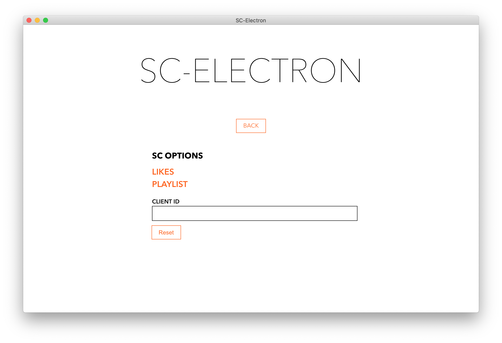
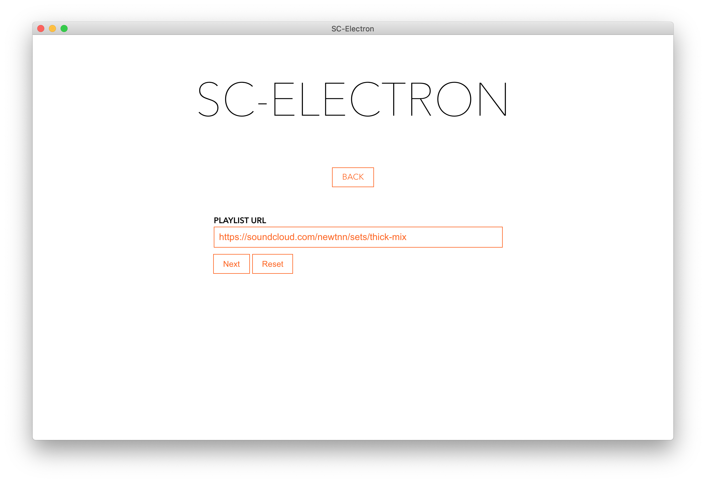
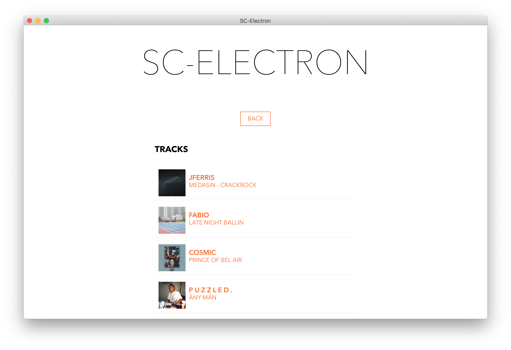
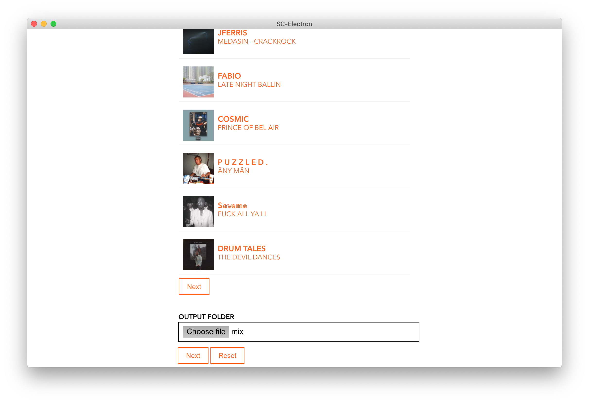
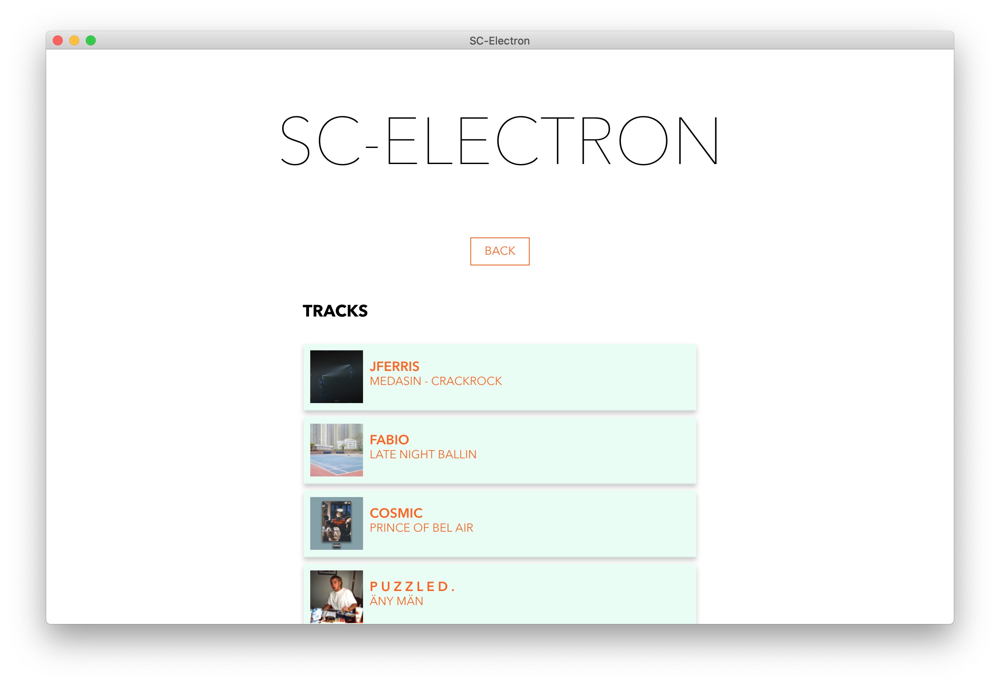
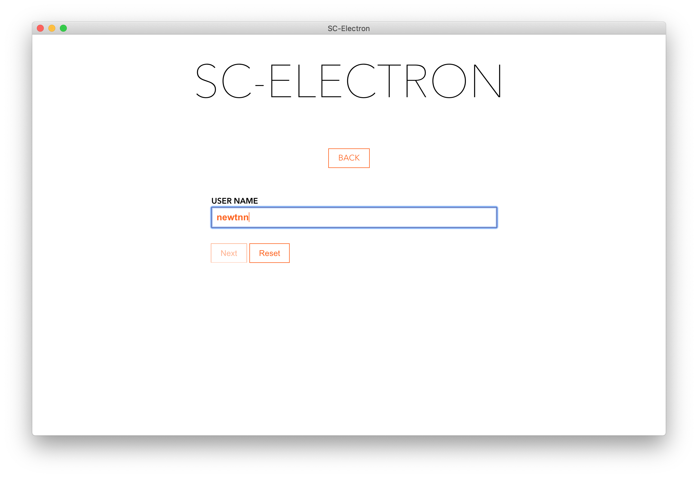
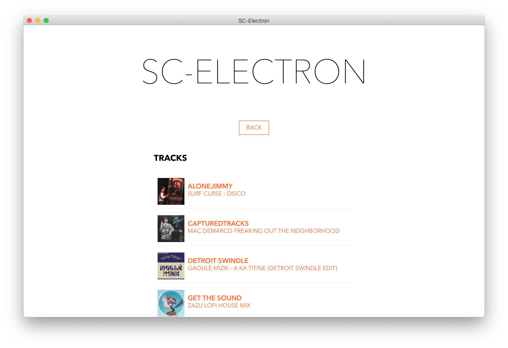
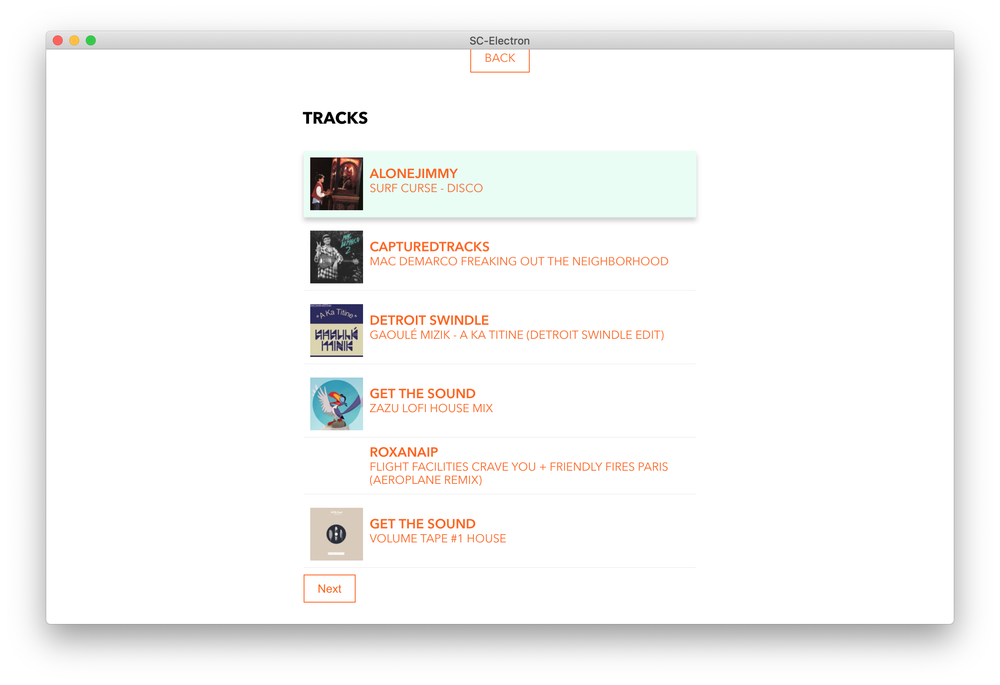
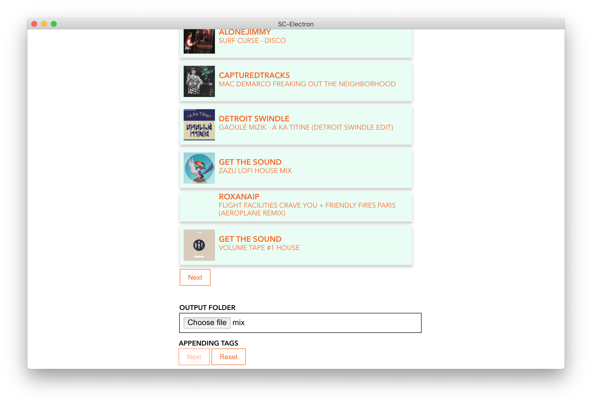

# Soundcloud Electron

Soundcloud downloader written in electron

* * *
## About
An app written in electron to download likes and playlists. It will tag all downloaded tracks with any metadata returned from Soundcloud.

## Getting Started
First login to Soundclound and grab your client id this can be easily pulled from the network tab from any browser keep this somewhere safe it should rotate every 12 hours or so.

### Playlists

Grab the full url of the playlist:

This should populate the tracks list

Select an output folder

Hit next and wait

### Likes

Grab the user name of the likes you want to get

This will populate list of tracks

Select and output folder and hit next

Wait for tagging to complete

# Bugs

Please add steps to reproduce in any bugs raised, screenshots are a bonus.
